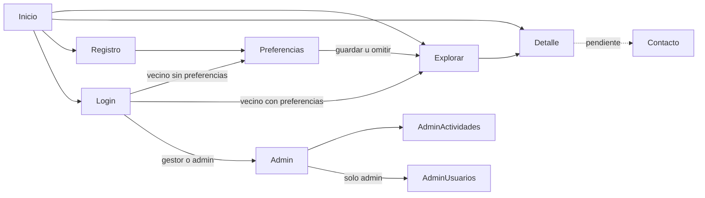

# 02 · Flujos y rutas

## Flujo unificado

## Tabla de rutas

| Ruta | Pantalla | Acceso |
|---|---|---|
| `/` | Inicio | público |
| `/explorar` | Explorar (vista mapa o lista según `?vista=`) | público |
| `/mapa` y `/actividades` | Redirigen a `/explorar?vista=mapa` y `?vista=lista` | público |
| `/actividades/:barrio/:slug` | Detalle | público |
| `/registro`, `/login` | Registro, Login | público (si hay sesión, redirige) |
| `/preferencias` | Bienvenida y Preferencias | sesión |
| `/contacto` | Contacto | público, **pendiente** |
| `/admin` | Dashboard | permiso `panel:acceder` |
| `/admin/actividades` | Listado | permiso `actividades:escribir` |
| `/admin/actividades/nueva`, `/admin/actividades/:id` | Formulario | permiso `actividades:escribir` |
| `/admin/usuarios` | Usuarios y roles | permiso `usuarios:gestionar` |
| `/403` y ruta no encontrada | Sin acceso, 404 | cualquiera |

Filtros de Explorar viajan en la URL: `?barrio=mataderos&categorias=ferias,cines&q=texto&vista=mapa`. Así la vista se comparte y el botón Atrás funciona.

El slug es único solo dentro del barrio, por eso el detalle lleva `:barrio` y `:slug`. La API usa el orden inverso (`/api/actividades/:slug/:barrioSlug`).

## Reglas de redirección

| Situación | Destino |
|---|---|
| Registro exitoso | `/preferencias` |
| Login de vecino que nunca guardó preferencias | `/preferencias` |
| Login de vecino con preferencias | `/explorar` con sus filtros aplicados |
| Login de gestor o admin | `/admin` |
| Visitante entra a ruta con sesión requerida | `/login`, recordando de dónde venía |
| Usuario con sesión entra a `/login` o `/registro` | Su destino por rol, como arriba |
| Usuario sin permiso entra a ruta de panel | Pantalla 403 (sin cambiar la URL) |
| Sesión vencida (respuesta 401) | Cerrar sesión local, avisar y llevar a `/login` con regreso |
| Preferencias guardadas | `/explorar` con filtros aplicados |
| Omitir preferencias | `/explorar` sin filtros |

Mensaje de sesión vencida: "Tu sesión venció. Ingresá de nuevo para seguir."

## Guardas
- Frontend: componente `<Protegida permiso="...">` (ver `codigo-de-referencia/rutas.jsx`). Oculta lo que no corresponde en el menú y muestra 403 si se entra por URL.
- Backend: la verificación real vive en el servidor. El frontend solo mejora la experiencia.
- Los permisos salen de una única tabla (`codigo-de-referencia/permisos.js`).
