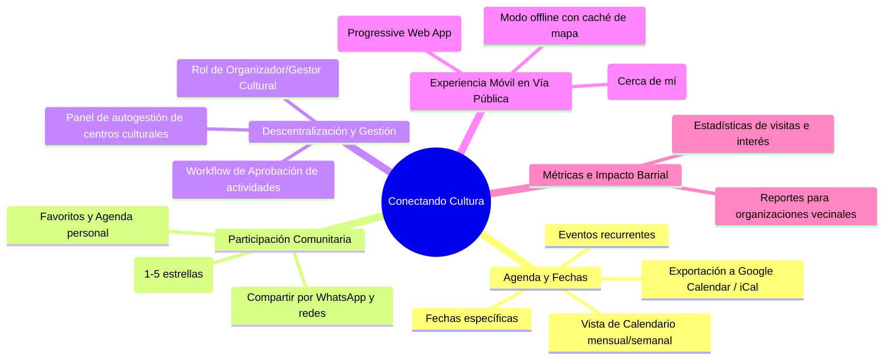

# Plan de Acción: Funciones Faltantes de la Planificación Inicial
## Conectando Cultura — Plataforma Sociocultural Barrial
> **Proyecto Integrador III** — Escuela Técnica N°20 DE 20 "Carolina Muzilli" (Polo Educativo de Mataderos)  
> **Área:** Desarrollo de Software, Arquitectura Web y Experiencia de Usuario (UI/UX)

---

## 1. Diagnóstico de la Planificación Inicial vs. Necesidades Reales

La planificación original (Sprints 1 al 8) cumplió con éxito la base fundamental del sistema:
- Autenticación segura y sesiones persistentes (scrypt + Bearer tokens en Supabase).
- Catálogo y mapa interactivo geolocalizado en Mataderos y barrios aledaños (Leaflet + OpenStreetMap + Google Maps).
- Preferencias de usuario por categorías culturales y barrios.
- Panel administrativo con control de acceso por roles (RBAC) y CRUD completo de actividades.
- Formulario de contacto y soporte con bitácora de mensajes y alertas.

Sin embargo, al contrastar el sistema con los **objetivos estratégicos del proyecto** (*"maximizar la difusión sociocultural", "diseño centrado en el vecino en la vía pública" y "participación comunitaria"*), se detectaron **8 áreas de oportunidad críticas** que no fueron contempladas en el backlog inicial.

---

## 2. Mapa de Funcionalidades Faltantes



---

## 3. Detalle de las Funcionalidades y Plan de Implementación

### Módulo A: Agenda Cultural y Calendario Estructurado
* **Problema:** En el modelo inicial, la disponibilidad es un texto libre (`horarios: "Sábados de 10 a 17h"`). Esto impide filtrar por "¿Qué hay para hacer hoy?", ordenar cronológicamente o alertar por fechas inminentes.
* **Solución Técnica:**
  - Nuevas columnas en `actividades`:
    - `fecha_inicio (DATE / TIMESTAMPTZ)`
    - `fecha_fin (DATE / TIMESTAMPTZ)`
    - `es_recurrente (BOOLEAN DEFAULT TRUE)`
    - `dias_semana (SMALLINT[] — 0=Dom, 6=Sáb)`
  - Endpoint `GET /api/actividades/agenda?desde=&hasta=`
  - Componente frontend de Calendario mensual/semanal con vista de eventos del día.
  - Botón *"Añadir a mi calendario"* (genera archivo `.ics` y enlace a Google Calendar).

---

### Módulo B: Favoritos y "Mi Agenda Cultural"
* **Problema:** El usuario puede seleccionar preferencias genéricas (recibir avisos de "Peñas"), pero no puede guardar una actividad concreta que le gustó para recordar visitarla.
* **Solución Técnica:**
  - Nueva tabla en Supabase:
    ```sql
    CREATE TABLE favoritos_usuario (
      id UUID PRIMARY KEY DEFAULT gen_random_uuid(),
      usuario_id TEXT NOT NULL REFERENCES usuarios(id) ON DELETE CASCADE,
      actividad_id UUID NOT NULL REFERENCES actividades(id) ON DELETE CASCADE,
      creado_en TIMESTAMPTZ NOT NULL DEFAULT NOW(),
      UNIQUE(usuario_id, actividad_id)
    );
    ```
  - Endpoints `GET /api/favoritos`, `POST /api/favoritos/:actividadId`, `DELETE /api/favoritos/:actividadId`.
  - Botón de corazón/guardado en las tarjetas y en la ficha técnica (`ActividadDetalle`).
  - Nueva página `/favoritos` para que el vecino tenga su propia lista curada.

---

### Módulo C: Reseñas, Calificaciones y Recomendaciones de Vecinos
* **Problema:** La plataforma es de comunicación unidireccional. La riqueza cultural de Mataderos se nutre de las recomendaciones boca a boca de los vecinos.
* **Solución Técnica:**
  - Nueva tabla:
    ```sql
    CREATE TABLE resenas (
      id UUID PRIMARY KEY DEFAULT gen_random_uuid(),
      usuario_id TEXT NOT NULL REFERENCES usuarios(id) ON DELETE CASCADE,
      actividad_id UUID NOT NULL REFERENCES actividades(id) ON DELETE CASCADE,
      calificacion SMALLINT NOT NULL CHECK (calificacion BETWEEN 1 AND 5),
      comentario TEXT NOT NULL CHECK (char_length(comentario) BETWEEN 5 AND 1000),
      estado TEXT NOT NULL DEFAULT 'publicado' CHECK (estado IN ('publicado', 'moderado', 'oculto')),
      creado_en TIMESTAMPTZ NOT NULL DEFAULT NOW()
    );
    ```
  - Promedio de estrellas visible en cada tarjeta y en la ficha técnica.
  - Moderación en el panel administrativo ante comentarios inapropiados.

---

### Módulo D: Portal de Gestores Culturales y Workflow de Aprobación
* **Problema:** Todo el mantenimiento recae sobre el rol `admin`. Referentes de peñas, centros culturales, clubes barriales y bibliotecas no pueden cargar sus propias propuestas.
* **Solución Técnica:**
  - Extensión de roles de usuario: `'usuario' | 'gestor' | 'admin'`.
  - Nueva columna en `actividades`: `estado ('borrador' | 'pendiente_aprobacion' | 'publicada' | 'rechazada')`.
  - Panel para que el gestor cultural postule talleres o eventos.
  - El administrador aprueba con un clic y se publica en el mapa oficial.

---

### Módulo E: Geolocalización en Tiempo Real ("Cerca de mí")
* **Problema:** En la calle, el vecino necesita saber qué actividades le quedan a pocas cuadras caminando.
* **Solución Técnica:**
  - Consumo de `navigator.geolocation.getCurrentPosition()`.
  - Marcador de "Tu ubicación actual" (ícono azul con pulso).
  - Cálculo de distancia geodésica (fórmula de Haversine en cliente / PostGIS en base de datos).
  - Ordenar catálogo por *"Más cercanas primero"* y filtro *"A menos de 10 cuadras"*.

---

### Módulo F: Progressive Web App (PWA) y Modo Fuera de Línea
* **Problema:** Conectividad intermitente en el espacio público (plazas, ferias, avenidas).
* **Solución Técnica:**
  - Plugin `@vite-pwa/plugin` en `frontend/`.
  - Web App Manifest con íconos adaptativos (192px, 512px) y tema naranja `#F98017`.
  - Service Worker con estrategia `Stale-While-Revalidate` para los datos de actividades y caché offline de tiles cartográficas de Leaflet.
  - Capacidad de *"Instalar en pantalla de inicio"* en celulares Android/iOS sin pasar por las tiendas.

---

### Módulo G: Difusión Social Inmediata (WhatsApp & Redes)
* **Problema:** El objetivo general es "maximizar la difusión". Si un vecino encuentra un festival folklórico o una clase de tango, compartirlo debe ser instantáneo.
* **Solución Técnica:**
  - Integración con Web Share API (`navigator.share`).
  - Botón directo *"Compartir por WhatsApp"* con texto enriquecido preformateado:
    > *¡Mirá esta actividad en Mataderos! 🎭 "Feria de las Artesanías y Tradiciones Populares" en Av. Lisandro de la Torre y De los Corrales. Conocé más acá: https://conectandocultura.ar/actividades/123*
  - Metadatos OpenGraph (og:title, og:description, og:image) para previsualizaciones ricas al enviar el enlace.

---

### Módulo H: Panel de Métricas de Impacto Barrial
* **Problema:** Los docentes y directivos del Polo Educativo de Mataderos necesitan evaluar el impacto real del proyecto en la comunidad.
* **Solución Técnica:**
  - Registro de visualizaciones anónimas de fichas técnicas (`visitas_actividad`).
  - Gráficos en el panel admin:
    - Actividades más consultadas del mes.
    - Categorías con mayor demanda por barrio.
    - Crecimiento de vecinos registrados.

---

## 4. Cronograma de Sprints de Evolución Futura

| Sprint | Épica / Objetivo | Entregable Clave |
|---|---|---|
| **Sprint 9** | **Agenda y Favoritos** | Fechas estructuradas, exportación a calendar y lista de favoritos por usuario. |
| **Sprint 10** | **Geolocalización y Cercanía** | GPS en tiempo real, cálculo de distancia y ordenamiento por proximidad. |
| **Sprint 11** | **Interacción Social y PWA** | PWA instalable offline, botón WhatsApp y reseñas comunitarias con estrellas. |
| **Sprint 12** | **Portal de Gestores y Métricas** | Rol gestor cultural, workflow de moderación y panel de métricas de impacto. |

---

## 5. Conclusión Arquitectural

El sistema actual cuenta con cimientos sólidos y limpios: separación estricta por capas (repositorios, servicios, controladores, componentes y vistas), persistencia íntegra en Supabase y tipado estricto sin `any`. 

Implementar este plan de acción permitirá que **Conectando Cultura** pase de ser un catálogo informativo a convertirse en la **red comunitaria viva de referencia para Mataderos y toda la Comuna 9**.
